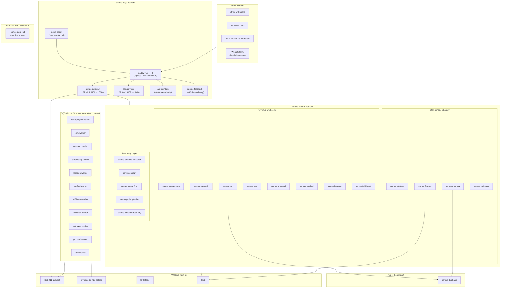
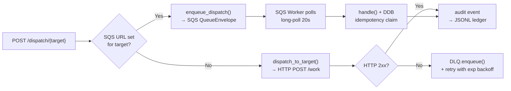
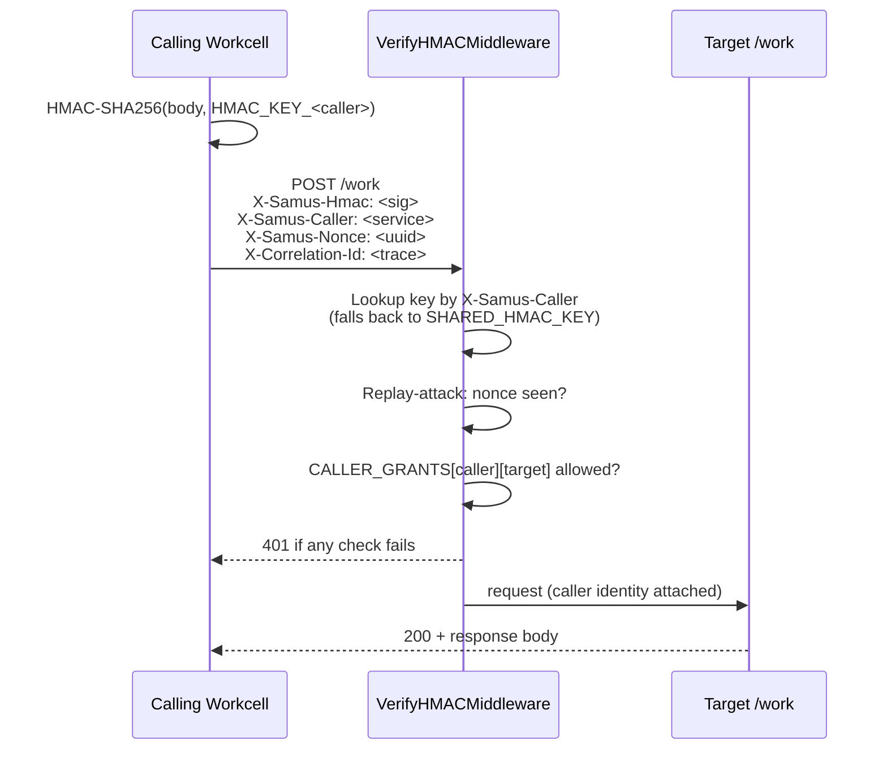
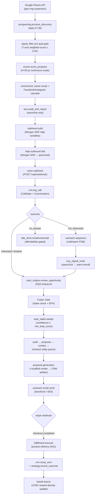
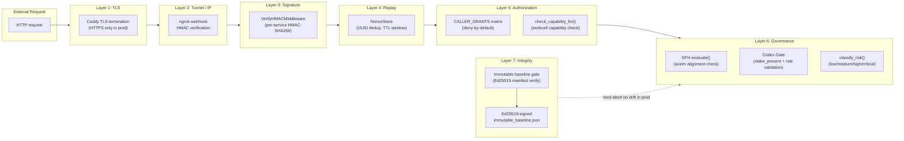
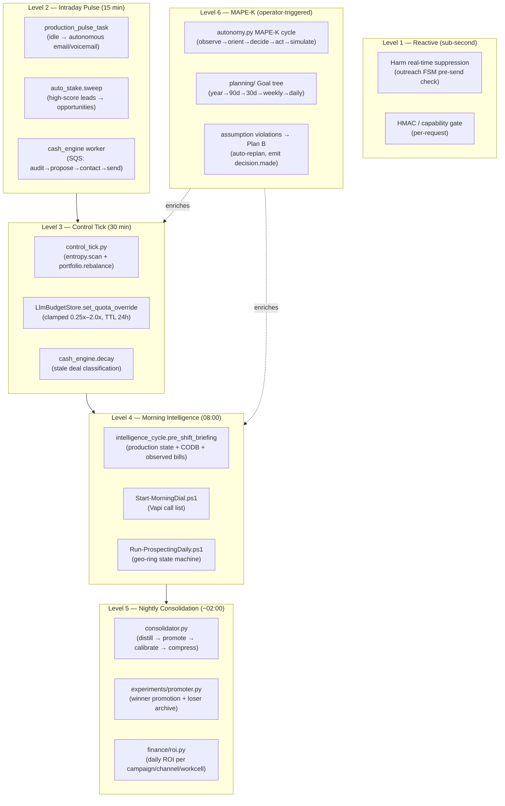
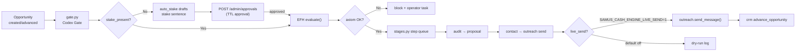
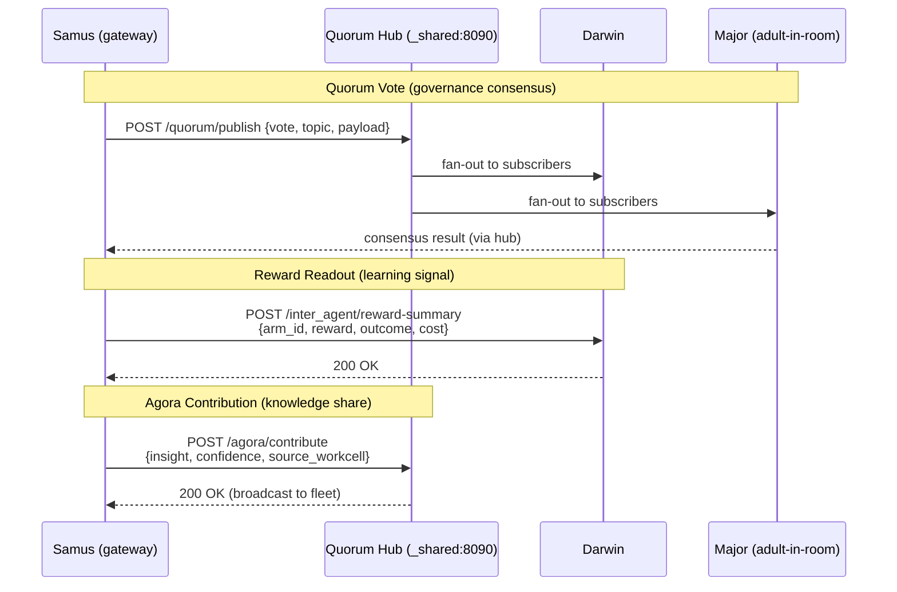

# Samus — Architecture Blueprint

**Version:** 2.2.0 | **Updated:** 2026-07-06 | **Python:** 3.11 | **Tests:** 5,442+

> **Purpose of this file.** A single-document reference for reconstructing Samus from
> scratch — service topology, wiring diagrams, security architecture, Mermaid system
> communication graphs, data store schema, and a step-by-step rebuild runbook. For the
> per-module version changelog and capability-registry detail, see
> [`ARCHITECTURE.md`](ARCHITECTURE.md). For ecosystem-level context (ports, cross-agent
> boundaries, service-account map), see [`Architecture_Samus.md`](Architecture_Samus.md).

---

## § 0  Quick Reference

| Fact | Value |
|---|---|
| Language | Python 3.11 |
| Web framework | FastAPI + Uvicorn (tini init) |
| Persistence | AWS DynamoDB + SQS + SNS + SES (us-west-1) |
| Graph | Neo4j 5.26 (`samus` database, host:7687) |
| Email | SendGrid (primary) + AWS SES (fallback / webhooks) |
| Voice | Vapi (outbound SDR + inbound receptionist) |
| LLM — local | LM Studio at `127.0.0.1:1234` (free, pre-revenue default) |
| LLM — cloud | Anthropic Haiku/Sonnet (metered, gated by `OPENAI_API_KEY` presence) |
| Container runtime | Docker Compose (local dev + HustleForge-VM) |
| Cloud target | GCP Cloud Run (`samus-<workcell>-2026`, `us-west1`) |
| Gateway host port | `127.0.0.1:8100` |
| Voice host port | `127.0.0.1:8107` |
| HTTP tunnel | ngrok (single tunnel, consolidated webhook endpoint) |
| TLS proxy | Caddy (reverse proxy in compose stack) |
| Non-root user | `samus` UID 10001 inside every container |
| Data volume | `samus-data` → `/opt/samus/data` |
| Total workcells | 22 (21 HTTP + 1 SQS-only: `cash_engine`) |
| SQS worker sidecars | 11 |
| Infrastructure containers | 3 (data-init, caddy/ingress, ngrok) |
| Test count | 5,442+ (full suite ~17 s; set `SAMUS_ARTIFACT_ROOT=tmp` on host) |

---

## § 1  Stack Overview

### Python dependencies (key runtime deps)

| Package | Role |
|---|---|
| `fastapi`, `uvicorn` | HTTP service framework |
| `boto3` | AWS SDK (SQS, DynamoDB, SNS, SES) |
| `httpx` | Async HTTP client (HMAC-signed inter-service calls) |
| `pydantic` (v2) | Request/response models, settings |
| `anthropic` | LLM client (Haiku/Sonnet via Anthropic API) |
| `openai` | LLM client (LM Studio compat endpoint) |
| `neo4j` | Neo4j Bolt driver |
| `sendgrid` | SendGrid email SDK |
| `stripe` | Stripe webhook verification + read |
| `prometheus-client` | Metrics counters/histograms |
| `cryptography` | Ed25519 (immutable baseline signatures) |
| `dnspython` | DNS lookups for SEO email-auth audit |
| `tqdm` | Progress bars in scripts |

---

## § 2  Service Topology

### 2.1  Container Map



### 2.2  Network Partitions

| Network | Containers | Reachable from outside? |
|---|---|---|
| `samus-edge` | gateway, voice, intake, feedback, caddy, ngrok | Yes (via caddy) |
| `samus-internal` | all 22 workcells + workers + caddy + ngrok | No (cluster-internal only) |

### 2.3  Port Map

| Container | Host binding | Container port | Protocol |
|---|---|---|---|
| `samus-gateway` | `127.0.0.1:8100` | 8080 | HTTP (Uvicorn) |
| `samus-voice` | `127.0.0.1:8107` | 8080 | HTTP (Uvicorn) |
| All other workcells | (internal only) | 8080 | HTTP (Uvicorn) |
| `ingress/caddy` | `0.0.0.0:443` | 80/443 | HTTPS |

---

## § 3  Dispatch & Communication Protocol

### 3.1  Gateway Dispatch Decision



### 3.2  HMAC Signing & Verification

Every inter-workcell call uses `signed_post_json()` in `common/http_client.py`.



**Key env vars:**
- `SAMUS_HMAC_KEY_<SERVICE>` — per-service signing key (e.g. `SAMUS_HMAC_KEY_GATEWAY`)
- `SAMUS_SHARED_HMAC_KEY` — fallback when per-service key is absent
- `SAMUS_AUTHZ_MODE` — `off` (default) | `audit` | `enforce`

**CALLER_GRANTS matrix** (defined in `backend/common/capabilities.py`): deny-by-default
caller → callee authorization matrix. Every inter-workcell pair that is allowed must have
an explicit entry. Missing entry → 403 in enforce mode, warning in audit mode.

### 3.3  SQS QueueEnvelope Contract

```
QueueEnvelope {
    task_id:         str       # idempotency key
    task_type:       str       # action name for the worker
    source_service:  str       # producing workcell name
    target_service:  str       # consuming workcell name
    payload:         dict      # action-specific data
    trace_id:        str       # correlation across services
    enqueued_at:     str       # ISO-8601 UTC
    retry_count:     int       # incremented by DLQ replayer
}
```

Workers use `BaseSqsWorker` from `common/worker_base.py`. Key properties:
- Long-poll 20 s; SIGTERM exits the poll loop within one tick
- DDB `samus_idempotency` claim-before-process (O_CREAT|O_EXCL pattern)
- On failure: message to DLQ, max 3 retries (exponential backoff), then archive

---

## § 4  Revenue Pipeline



### 4.1  Idle Production Drive

When no outbound call or email is processing for `SAMUS_PRODUCTION_PULSE_IDLE_THRESHOLD_S`
seconds, `production_pulse_task.py` fires a fast re-evaluation cycle:
- Checks `affordability.py` budget posture (conserve / lean / invest)
- In invest/lean: dispatches autonomous email or voicemail to top-scored prospects
- Gated by `SAMUS_IDLE_PRODUCTION_DRIVE_ENABLED`

### 4.2  Auto-Stake Sweep

`auto_stake.py` runs on the control-tick cadence. For prospects with
`lead_score ≥ SAMUS_AUTO_STAKE_MIN_LEAD_SCORE` and an owner email, it opens an
Opportunity and enqueues a `cash_engine` job — removing the typing bottleneck for
high-confidence leads.

---

## § 5  Security Architecture

### 5.1  Defense-in-Depth Layers



### 5.2  Immutable Baseline Gate

File: `backend/identity/immutable_manifest.py`  
Manifest: `Samus/immutable_baseline.json` (Ed25519-signed by operator)

12 protected core files. On boot with `SAMUS_IMMUTABLE_GATE_MODE=enforce` +
`SAMUS_ENV=production`: hash each file, verify signature, abort if any drift.

**To re-sign after a legitimate change:**
```powershell
python scripts/sign_immutable_baseline.py   # operator ceremony
```

### 5.3  Governance Layers

| Layer | File | What it blocks |
|---|---|---|
| Codex Gate | `cash_engine/gate.py` | Revenue actions without an approved stake sentence |
| EFH Evaluator | `governance/efh_evaluator.py` | Axiom violations (meaning anchors + existential failure hazards) |
| Risk classifier | `common/governance.py` | HIGH/CRITICAL actions routed to approval queue |
| Approval queue | `common/approval_queue.py` | ADR-0019 TTL-bounded operator approvals |
| HOTL approvals | `GET/POST /admin/approvals` | Operator one-click approve / batch-approve |
| CAN-SPAM guard | `common/compliance_guard.py` | Audit/enforce email compliance (suppress + log) |
| Harm suppression | `outreach/service.py` | ≥1 complaint/unsubscribe → real-time send block |

### 5.4  Capability Registry

`backend/common/capabilities.py` defines `SERVICE_CAPABILITIES` — a map from workcell
name to the set of capabilities it declares. The `check_capability_for(caller, action)`
function is called on every routed request in enforce mode.

**Key capabilities:**
- `send_outreach` — email/voice dispatch (outreach, voice, gateway)
- `read_crm` — CRM reads (prospecting, strategy, cognitive, morning)
- `write_crm` — CRM writes (gateway, cash_engine, voice, outreach, intake, finance)
- `plan_execution` — autonomous workcells (signal_filter, path_optimizer, template_recovery, portfolio_controller, entropy)
- `financial_read` — finance reads (cognitive, gateway)
- `governance_review` — Codex Gate + risk classification (gateway, cash_engine)

### 5.5  Public Surface Hardening

| Surface | Hardening |
|---|---|
| `POST /intake/onboarding` | DDB per-IP rate limiter (5/min, 30/hr, 600/hr global); optional Turnstile CAPTCHA |
| Intake form fields | CR/LF stripping (header-injection defence); multi-line field fencing |
| `X-Forwarded-For` | Takes `SAMUS_INTAKE_TRUSTED_PROXY_HOPS` from right (not leftmost) |
| Stripe webhook | `livemode=false` rejected in production; atomic `O_CREAT|O_EXCL` idempotency claim |
| Vapi webhook | HMAC verify (cannot be disabled in production env) |
| SNS SubscribeURL | Validated against AWS SNS HTTPS allowlist (`SAMUS_FEEDBACK_VERIFY_SNS`) |
| SSRF | `backend/common/safe_fetch.py` — blocks private/loopback/CGNAT IPs + re-validates every redirect hop |
| Stripe test-mode | Rejected (`SAMUS_STRIPE_REJECT_TEST_MODE`) in production |

---

## § 6  Autonomy Architecture

### 6.1  Multi-Level Autonomy Stack



### 6.2  Control Tick Detail

File: `backend/gateway/control_tick.py`  
Trigger: `POST /admin/control-tick` (also fires from `control_tick_task.py` in-container)

```
1. entropy.scan()                   → entropy_score + countermeasure list
2. portfolio_controller.rebalance() → token_quota_cuts + priority_weights
3. [enforce] LlmBudgetStore.set_quota_override() per workcell
4. log to control_tick_ledger.jsonl
5. emit decision.made business event
```

Kill switch: `SAMUS_CONTROL_TICK_ENFORCE=0`

### 6.3  Cognitive Loop (Phase F)

Files: `backend/cognitive/runner.py`, `cognitive_loop.py`  
Default: **dormant** (`SAMUS_COGNITIVE_LOOP_ENABLED`)

```
PERCEIVE  → domain_perception.LiveDomainProvider (production state snapshot)
REASON    → meta_cognition_engine (reflection + belief update)
ACT       → proposal_promoter (propose-only — no autonomous execution in Phase F)
```

Sub-flags: `SAMUS_AUTONOMY_META_ENABLED`, `SAMUS_COGNITIVE_ACT_PROPOSALS_ENABLED`

### 6.4  Cash Engine Pipeline (Autonomous)



### 6.5  Memory Consolidation (Nightly ~02:00)

File: `backend/cognitive/consolidation_task.py`

```
1. Distill:   scan unified business events + reward ledger
              → semantic lessons written to guidance_ledger.jsonl
              → active_guidance_context() feeds next-day REASON stage

2. Promote:   experiments/promoter.py
              → winner arms: raise allocation floor + clone to templates
              → loser arms: archive + generate replacement (1 Haiku call)
              → stop rule: campaign-level kill if conversion < threshold

3. Calibrate: refresh crm/scoring.py tier close-probabilities
              → from actual closed-loop rates (replaces hand-tuned constants)

4. Compress:  JsonlLedger.rotate_by_age(max_age_hours=720)
              → archives to <stem>.archive.jsonl (nothing deleted)
```

---

## § 7  Data Stores

### 7.1  DynamoDB Tables

| Table | Primary Key | Sort Key | Workcell Owner | Purpose |
|---|---|---|---|---|
| `samus_task_state` | `task_id` | — | common | Task lifecycle state (pending/running/done/failed) |
| `samus_idempotency` | `idempotency_key` | — | common | Claim-before-process dedup + Stripe event dedup |
| `samus_suppression` | `email` | — | outreach | SendGrid bounce/complaint suppression list |
| `samus_feedback_events` | `message_id` | — | feedback | SES bounce/complaint log |
| `samus_onboarding_leads` | `lead_id` | — | intake | Website form submissions (pre-CRM) |
| `samus_llm_budgets` | `workcell` | — | common | Per-workcell daily token counter + EMA quota |
| `samus_strategy_bandit` | `arm_key` | — | strategy | UCB1 bandit stats (wins/trials/mean_reward) |
| `samus_approvals` | `approval_id` | — | governance | ADR-0019 HOTL approval queue (TTL-bounded) |
| `samus_prospects` | `prospect_id` | — | crm | Prospect profile + enrichment state |
| `samus_contacts` | `contact_id` | `prospect_id` | crm | Contact records (email/phone/name) |
| `samus_conversations` | `conversation_id` | `prospect_id` | crm | Call + email interaction log |
| `samus_call_state` | `prospect_id` | — | crm | Current call disposition + next attempt |
| `samus_opportunities` | `opportunity_id` | `prospect_id` | crm | Deal pipeline (stage, score, stake) |
| `samus_operator_tasks` | `task_id` | — | crm | Operator action queue (human-in-the-loop) |
| `samus_artifacts` | `artifact_id` | `prospect_id` | crm | Proposal docs, SEO reports, call transcripts |

### 7.2  SQS Queues

| Queue env var | Consumer worker | Workcell | Message type |
|---|---|---|---|
| `SQS_CASH_ENGINE_QUEUE_URL` | `cash_engine-worker` | cash_engine | Revenue pipeline jobs |
| `SQS_CRM_QUEUE_URL` | `crm-worker` | crm | Artifact create / CRM writes |
| `SQS_OUTREACH_QUEUE_URL` | `outreach-worker` | outreach | Email / sequence jobs |
| `SQS_PROSPECTING_QUEUE_URL` | `prospecting-worker` | prospecting | Discovery jobs |
| `SQS_LEADGEN_QUEUE_URL` | `leadgen-worker` | leadgen | Lead enrichment (Vapi Node 4) |
| `SQS_SCAFFOLD_QUEUE_URL` | `scaffold-worker` | scaffold | Asset generation |
| `SQS_FULFILLMENT_QUEUE_URL` | `fulfillment-worker` | fulfillment | Product delivery |
| `SQS_FEEDBACK_QUEUE_URL` | `feedback-worker` | feedback | SES bounce/complaint SNS fanout |
| `SQS_OPTIMIZER_QUEUE_URL` | `optimizer-worker` | optimizer | Bandit update jobs |
| `SQS_PROPOSAL_QUEUE_URL` | `proposal-worker` | proposal | Proposal generation |
| `SQS_SEO_QUEUE_URL` | `seo-worker` | seo | SEO audit jobs |

### 7.3  JSONL Ledgers (under `/opt/samus/data/`)

| Ledger | Path | Retention | Purpose |
|---|---|---|---|
| Audit ledger | `audit/audit_ledger.jsonl` | indefinite | HMAC-chained event log |
| Business events | `common/business_events.jsonl` | rotate 30d | Unified event stream (T1.1) |
| Control tick | `gateway/control_tick_ledger.jsonl` | rotate 30d | Control-loop tick history |
| Intake (inbound email) | `intake/inbound_email.jsonl` | rotate 30d | Classified Gmail messages |
| Guidance | `cognitive/guidance_ledger.jsonl` | indefinite | Distilled economic lessons |
| Bank activity | `finance/bank_activity.jsonl` | indefinite | Cash App / Mercury bank rows |
| Outreach metrics | `outreach/outreach_metrics.jsonl` | rotate 30d | Per-send engagement signals |
| Reward | `strategy/reward_ledger.jsonl` | rotate 90d | Bandit reward records |
| Experiment assignments | `experiments/assignments.jsonl` | rotate 90d | Replayable A/B assignments |
| DLQ (per-service) | `dlq/<service>/failures.jsonl` | replay → archive | Dead-letter queue |

### 7.4  Neo4j Graph Schema

Database: `samus` (Neo4j 5.26, Bolt at `host.docker.internal:7687`)

**Node labels:**

| Label | Key property | Description |
|---|---|---|
| `Prospect` | `prospect_id` | Discovered business |
| `Contact` | `contact_id` | Individual (email/phone) |
| `Opportunity` | `opportunity_id` | Open deal |
| `Conversation` | `conversation_id` | Call/email interaction |
| `KnowledgeItem` | `item_id` | Distilled knowledge (tiered) |
| `GuidelineItem` | `item_id` | Strategic guidance lesson |

**Key relationships:**

```
(Prospect)-[:HAS_CONTACT]->(Contact)
(Prospect)-[:HAS_OPPORTUNITY]->(Opportunity)
(Prospect)-[:HAS_CONVERSATION]->(Conversation)
(Contact)-[:PARTICIPATED_IN]->(Conversation)
(KnowledgeItem)-[:RELATED_TO]->(KnowledgeItem)
```

Write path: `crm/hivemind_projection.py` (MERGE-idempotent; fail-soft when Neo4j is down)  
Kill switch: `SAMUS_CRM_HIVEMIND_PROJECTION_ENABLED=false`

---

## § 8  Workcell Reference

| Workcell | HTTP App | SQS Worker | Primary Capability | Key function |
|---|---|---|---|---|
| `gateway` | :8100 | cash_engine-worker | orchestration | Operator surface + dispatch router + autonomy loops |
| `crm` | :8080 | crm-worker | write_crm | 7-table customer pipeline (DDB backend) |
| `prospecting` | :8080 | prospecting-worker | discover_leads | Google Places → lead score → callsheet |
| `outreach` | :8080 | outreach-worker | send_outreach | Email/sequence dispatch + compliance guard |
| `voice` | :8107 | — | voice_dial | Vapi outbound SDR + inbound receptionist webhook |
| `finance` | :8080 | — | financial_read | Stripe + CODB + runway + bank activity |
| `seo` | :8080 | seo-worker | audit_seo | On-page + PageSpeed + security audit |
| `strategy` | :8080 | — | portfolio_strategy | UCB1 bandit + reward-density + predictive allocator |
| `intake` | :8080 | — | intake_form | Website form + Gmail poller + email classifier |
| `memory` | :8080 | — | knowledge_store | Vector store + Neo4j KG + customer profiles |
| `feedback` | :8080 | feedback-worker | handle_feedback | SES bounce/complaint SNS receiver |
| `proposal` | :8080 | proposal-worker | generate_proposal | Proposal drafting + validation |
| `scaffold` | :8080 | scaffold-worker | generate_scaffold | Campaign asset rendering |
| `leadgen` | :8080 | leadgen-worker | qualify_lead | Lead qualification (Vapi Node 4 producer) |
| `fulfillment` | :8080 | fulfillment-worker | deliver_product | Product delivery DAG |
| `optimizer` | :8080 | optimizer-worker | optimize_bandit | Thompson sampling + portfolio optimization |
| `signal_filter` | :8080 | — | plan_execution | Prospect pre-qual gate (7-axis weighted score) |
| `path_optimizer` | :8080 | — | plan_execution | EMA-driven execution route selection |
| `template_recovery` | :8080 | — | plan_execution | Zero-LLM deterministic fallback scaffold |
| `portfolio_controller` | :8080 | — | plan_execution | Token-quota + priority-weight rebalancing |
| `entropy` | :8080 | — | plan_execution | Systemic instability score + countermeasures |
| `cash_engine` | — | cash_engine-worker | governance_review | Revenue pipeline SQS worker (no HTTP app) |

---

## § 9  Environment Variable Reference

### 9.1  Authentication & Security

| Variable | Default | Description |
|---|---|---|
| `SAMUS_SHARED_HMAC_KEY` | — | Fallback HMAC key (all services) |
| `SAMUS_HMAC_KEY_<SERVICE>` | — | Per-service HMAC key (overrides shared) |
| `SAMUS_AUTHZ_MODE` | `off` | Capability enforcement: `off` / `audit` / `enforce` |
| `SAMUS_IMMUTABLE_GATE_MODE` | `off` | Integrity gate: `off` / `audit` / `enforce` |
| `SAMUS_OPERATOR_TOKEN` | — | Bearer token for `/admin/*` routes |
| `SAMUS_VOICE_CONSOLE_TOKEN` | — | Bearer token for voice operator console |
| `SAMUS_VOICE_VERIFY_WEBHOOK` | `true` | Vapi webhook HMAC verification |
| `SAMUS_FEEDBACK_VERIFY_SNS` | `true` | SNS signature verification (fail-closed in prod) |
| `SAMUS_STRIPE_REJECT_TEST_MODE` | `false` | Reject test-mode Stripe events in production |

### 9.2  LLM Budget

| Variable | Default | Description |
|---|---|---|
| `SAMUS_LM_STUDIO_URL` | `http://host.docker.internal:1234/v1` | Local LM Studio base URL |
| `OPENAI_API_KEY` | — | Present = paid LLM enabled; absent = LM Studio only |
| `ANTHROPIC_API_KEY` | — | Anthropic API (legacy no-op for most paths; EOD triangulation leg C) |
| `SAMUS_LLM_PRIMARY` | `local` | Primary backend (`local` / `openai`) |
| `SAMUS_LLM_DAILY_FLOOR_USD` | `0.10` | Minimum daily LLM spend gate |
| `SAMUS_LLM_DAILY_CEILING_USD` | `1.00` | Maximum daily LLM spend (hard cap) |
| `SAMUS_LLM_REINVEST_PCT` | `0.20` | Fraction of Stripe revenue reinvested in LLM |
| `SAMUS_EFH_SEMANTIC` | `1` | EFH semantic axiom layer (disable with `=0`) |
| `SAMUS_RATE_LIMIT_ENABLED` | `true` | In-process rate limiter (set `=false` in tests) |

### 9.3  External APIs

| Variable | Service |
|---|---|
| `GOOGLE_PLACES_API_KEY` | Prospect discovery (geo-ring) |
| `GOOGLE_PAGESPEED_API_KEY` | SEO PageSpeed audit |
| `APOLLO_API_KEY` | Owner email lookup (daily $-cap) |
| `STRIPE_API_KEY` | Stripe dashboard reads |
| `STRIPE_WEBHOOK_SECRET` | Stripe webhook signature |
| `VAPI_API_KEY` | Vapi outbound/inbound calls |
| `VAPI_WEBHOOK_SECRET` | Vapi webhook HMAC |
| `VAPI_ASSISTANT_ID` | Morgan SDR assistant ID |
| `VAPI_PHONE_NUMBER_ID` | Outbound DID |
| `SENDGRID_API_KEY` | Email dispatch |
| `SENDGRID_FROM_EMAIL` | From address |
| `SENDGRID_WEBHOOK_VERIFICATION_KEY` | SendGrid event webhook |
| `GEMINI_API_KEY` | Flyer hero image generation |
| `NGROK_AUTHTOKEN` | ngrok tunnel auth |
| `MERCURY_API_TOKEN` | Mercury bank API (wire-dormant) |

### 9.4  AWS

| Variable | Description |
|---|---|
| `AWS_ACCESS_KEY_ID` / `AWS_SECRET_ACCESS_KEY` / `AWS_REGION` | AWS credentials |
| `SQS_*_QUEUE_URL` (11 vars) | Per-workcell SQS queue endpoints |
| `DDB_*_TABLE` (8+ vars) | DynamoDB table names (override defaults) |

### 9.5  Storage & Paths

| Variable | Default | Description |
|---|---|---|
| `SAMUS_DATA_ROOT` | `/opt/samus/data` | Base for all state/ledger paths |
| `SAMUS_ARTIFACT_ROOT` | `${SAMUS_DATA_ROOT}/artifacts` | Operator artifact output root |
| `SAMUS_FOUND_ACTIVITY_DIR` | — | Directory of bank CSV exports |
| `SAMUS_BANK_ACTIVITY_LEDGER_PATH` | `${SAMUS_DATA_ROOT}/finance/bank_activity.jsonl` | Bank activity ledger |
| `NEO4J_URI` | `bolt://host.docker.internal:7687` | Neo4j connection |
| `NEO4J_USER` / `NEO4J_PASSWORD` | — | Neo4j credentials |

### 9.6  Autonomy Flags

| Variable | Default | Effect |
|---|---|---|
| `SAMUS_COGNITIVE_LOOP_ENABLED` | `false` | Master switch for Phase-F cognitive loop |
| `SAMUS_IDLE_PRODUCTION_DRIVE_ENABLED` | `true` | Autonomous email/voicemail when queue quiet |
| `SAMUS_GOVERNED_AUTONOMOUS_DIAL_ENABLED` | `false` | Autonomous Vapi dial (consent-fenced ADR-016) |
| `SAMUS_AUTO_STAKE_ENABLED` | `true` | Auto-promote high-score leads to opportunities |
| `SAMUS_AUTO_STAKE_MIN_LEAD_SCORE` | `70` | Minimum score for auto-stake |
| `SAMUS_AUTO_STAKE_MAX_PER_SWEEP` | `5` | Max auto-stakes per control-tick sweep |
| `SAMUS_PRODUCTION_PULSE_ENABLED` | `true` | Idle-signal-driven campaign pulse |
| `SAMUS_PRODUCTION_PULSE_SEC` | `900` | Pulse interval (seconds) |
| `SAMUS_PRODUCTION_PULSE_IDLE_THRESHOLD_S` | `600` | Idle threshold before pulse fires |
| `SAMUS_CODB_REASONER_ENABLED` | `true` | CODB investment reasoning |
| `SAMUS_REENGAGEMENT_ENABLED` | `true` | Soft-no re-engagement sweep |
| `SAMUS_REENGAGEMENT_COOLDOWN_DAYS` | `30` | Days before soft-no re-engagement |
| `SAMUS_PROSPECTING_IN_STACK_CADENCE_ENABLED` | `true` | In-stack daily prospecting (ADR-014) |
| `SAMUS_CONSOLIDATION_ENABLED` | `true` | Nightly memory consolidation |
| `SAMUS_CONSOLIDATION_SCHEDULE_HOUR` | `2` | Hour (local) for nightly consolidation |
| `SAMUS_CASH_ENGINE_LIVE_SEND` | `false` | Enable live outreach sends from cash_engine |
| `SAMUS_SELF_SUPPLY_ENABLED` | `true` | Starvation-aware prospecting fallback |
| `SAMUS_CONTROL_TICK_ENFORCE` | `1` | Apply quota cuts from control-tick (set `=0` to observe-only) |
| `SAMUS_ISV_CONSUMER_ENABLED` | `true` | Inter-agent ISV protocol consumer |
| `SAMUS_PDC_OBSERVE_ENABLED` | `true` | PDC composite observer |
| `SN_AGORA_CONTRIBUTE_ENABLED` | `false` | Agora v2 contribution to fleet |
| `SN_REWARD_READOUT_ENABLED` | `true` | Darwin reward readout dispatch |
| `SAMUS_QUORUM_PUBLISH_ENABLED` | `false` | Cross-agent Quorum Hub publish |
| `SAMUS_ATTRIBUTION_ENABLED` | `true` | Revenue attribution (UCB1 variant selection) |
| `SAMUS_EXP_UPLIFT_GATE` | `false` | Require causal uplift before experiment promotion |

---

## § 10  Scheduled Tasks (Windows Task Scheduler on AOT-TOWER)

All tasks registered via `Register-*.ps1` scripts. Use `-Command "& script"` not `-File`
(AOT-TOWER: `-File` silently fails with non-zero Last Result).

| Task | Script | Cadence | What it does |
|---|---|---|---|
| `Samus-MorningBrief` | `Register-MorningBriefSchedule.ps1` | Daily 08:00 | Pre-shift intelligence briefing → SendGrid + Discord + Telegram |
| `Samus-ProspectingDaily` | `Register-ProspectingDailySchedule.ps1` | Daily 07:30 | Geo-ring prospect discovery (Yuba → Sacramento metro) |
| `Samus-OutreachDaily` | `Register-OutreachDailySchedule.ps1` | Daily 09:00–18:00 | Outreach sequence dispatch |
| `Samus-InboxPoll` | `Register-InboxPollSchedule.ps1` | Every 10 min | Gmail inbox poll → classify → CRM intake |
| `Samus-BillScan` | `Register-BillScanSchedule.ps1` | Daily | Gmail bill scan → CODB registry update |
| `Samus-ProductionHealth` | `Register-ProductionHealthSchedule.ps1` | Every 15 min | Stack health probe → email alert on degraded |
| `Samus-Consolidation` | `Register-ConsolidationSchedule.ps1` | Daily ~02:00 | Memory consolidation (distill → promote → calibrate → compress) |
| `Samus-MorningCampaign` | `Register-SamusMorningCampaign.ps1` | Daily 08:30 | Morgan SDR morning dial campaign |
| `Samus-CloudDutyCycle` | `Register-SamusCloudDutyCycleSchedule.ps1` | Hourly | Cloud Run health + metrics sync |
| `Samus-CloudScheduler` | `Register-CloudSchedulerJobs.ps1` | One-time | GCP Cloud Scheduler job setup |

**In-container tasks** (no host Task Scheduler entry):
- `control_tick_task.py` — 30-min control tick (runs inside `samus-gateway` container)
- `production_pulse_task.py` — 15-min production pulse (runs inside `samus-gateway` container)
- `consolidation_task.py` — nightly consolidation (also runs in container as fallback)

---

## § 11  Cross-Agent Communication

Samus operates inside the 5-agent Hustleforge ecosystem. Three cross-agent protocols are implemented:



**Quorum Hub:** `_shared/quorum_hub/`, starts on port 8090, **no scheduled task** —
must be started manually: `cd _shared && python -m quorum_hub.server`

**Protocol flags:**
- `SAMUS_QUORUM_PUBLISH_ENABLED` — publish votes to hub
- `SN_AGORA_CONTRIBUTE_ENABLED` — contribute insights to fleet
- `SN_REWARD_READOUT_ENABLED` — send reward signals to Darwin

---

## § 12  Operator Surfaces

### 12.1  Gateway Admin Routes

| Route | Method | Auth | Purpose |
|---|---|---|---|
| `/admin/llm_budgets` | GET | operator token | Per-workcell daily token snapshot + EMA quota |
| `/admin/tasks` | GET | operator token | CRM operator-task queue |
| `/admin/conversion_funnel` | GET | operator token | Funnel leak analysis |
| `/admin/journey/{prospect_id}` | GET | operator token | Full prospect journey from unified event stream |
| `/admin/control-tick` | POST | operator token | Fire one control-loop observe→decide pass |
| `/admin/control-ticks` | GET | operator token | Recent tick history (JSONL ledger) |
| `/admin/approvals` | GET/POST | operator token | HOTL approval queue (ADR-0019) |
| `/admin/economics` | GET | operator token | Daily ROI roll-up (campaign/channel/workcell) |
| `/admin/experiments/{id}/uplift` | GET | operator token | Causal uplift for an experiment arm |
| `/admin/deliberate` | POST | operator token | Deliberation router (value-of-computation) |
| `/api/crm/stats` | GET | — (30s cache) | Samus HUD (calls/emails/booked today) |

### 12.2  Voice Operator Console

URL: `http://127.0.0.1:8107/console`  
Auth: `SAMUS_VOICE_CONSOLE_TOKEN` (Bearer — browser-safe, no HMAC)  
Script: `scripts/Open-VoiceConsole.ps1` (optional `-StartStackIfDown`)

### 12.3  Morning Brief Channels

1. **Email** (SendGrid) → the configured `SAMUS_MORNING_EMAIL_TO` recipient
2. **Discord** (webhook) → operator Discord server
3. **Telegram** (Bot API) → operator channel

---

## § 13  Rebuild Runbook

Step-by-step from a clean Windows workstation to a running Samus stack.

### Prerequisites

```
[ ] Python 3.11 installed (python.exe on PATH)
[ ] Docker Desktop running (Engine accessible to non-elevated user)
[ ] Git + Git Credential Manager (for GitHub authentication)
[ ] AWS CLI configured (aws configure or DPAPI-sealed keys)
[ ] Neo4j 5.26 running on host (default port 7687)
[ ] LM Studio running at 127.0.0.1:1234 (at least one model loaded)
```

### Step 1 — Clone & virtualenv

```powershell
git -C D:\Hustleforge\Samus status          # verify branch: samus
cd D:\Hustleforge\Samus
python -m venv .venv
.\.venv\Scripts\Activate.ps1
pip install -r requirements.txt
```

### Step 2 — Seal secrets into DPAPI

```powershell
# Run as Alex (non-elevated). Seals one secret at a time.
python -c "from Samus.scripts.Samus_Secrets import Set-HfSecret; ..."
# Or use the provided Set-HfSecret PS function.
# Required secrets: OPENAI_API_KEY, SAMUS_SHARED_HMAC_KEY, SAMUS_OPERATOR_TOKEN,
#   VAPI_API_KEY, VAPI_WEBHOOK_SECRET, VAPI_ASSISTANT_ID, VAPI_PHONE_NUMBER_ID,
#   SENDGRID_API_KEY, STRIPE_API_KEY, STRIPE_WEBHOOK_SECRET,
#   AWS_ACCESS_KEY_ID, AWS_SECRET_ACCESS_KEY,
#   GOOGLE_PLACES_API_KEY, GOOGLE_PAGESPEED_API_KEY,
#   NEO4J_PASSWORD, NGROK_AUTHTOKEN
```

### Step 3 — Build Docker images

```powershell
cd D:\Hustleforge\Samus\docker\compose
docker compose -f docker-compose.samus.yml build
```

### Step 4 — Start the stack

```powershell
# Start-SamusStack.ps1 reads DPAPI → writes .env → compose up → scrubs .env on exit
D:\Hustleforge\Samus\scripts\Start-SamusStack.ps1
```

### Step 5 — Verify

```powershell
# Health checks
curl http://127.0.0.1:8100/health          # gateway → 200
curl http://127.0.0.1:8107/health          # voice   → 200

# Preflight (env + AWS + DDB + Neo4j)
.\.venv\Scripts\python.exe -m backend.tools.preflight

# Run test suite (set artifact root to tmp so no E:\ access needed)
$env:SAMUS_ARTIFACT_ROOT = "tmp"
.\.venv\Scripts\python.exe -m pytest tests/ -x -q --tb=short
# Expected: 5,442+ passing, 24 pre-existing failures at HEAD
```

### Step 6 — Register scheduled tasks

```powershell
# Run each Register-*.ps1 once to create Task Scheduler entries
D:\Hustleforge\Samus\scripts\Register-MorningBriefSchedule.ps1
D:\Hustleforge\Samus\scripts\Register-ProspectingDailySchedule.ps1
D:\Hustleforge\Samus\scripts\Register-InboxPollSchedule.ps1
D:\Hustleforge\Samus\scripts\Register-OutreachDailySchedule.ps1
D:\Hustleforge\Samus\scripts\Register-ProductionHealthSchedule.ps1
D:\Hustleforge\Samus\scripts\Register-ConsolidationSchedule.ps1
D:\Hustleforge\Samus\scripts\Register-SamusMorningCampaign.ps1
D:\Hustleforge\Samus\scripts\Register-BillScanSchedule.ps1
```

### Step 7 — Re-sign immutable baseline (if protected files changed)

```powershell
python scripts/sign_immutable_baseline.py
# Requires operator private key (Ed25519). Keep key offline.
```

### Step 8 — Seed Gmail OAuth (first time)

```powershell
python -m backend.intake.gmail_oauth --authorize
# Opens browser → OAuth consent → stores token in DPAPI
# IMPORTANT: move Google Cloud project to "Internal" app type
# to prevent 7-day refresh token expiry.
```

### Step 9 — Ingest initial bank activity

```powershell
# Place Cash App / Mercury CSV exports in a local directory
D:\Hustleforge\Samus\scripts\Ingest-BankActivity.ps1 -Path "C:\path\to\export.csv"
# Then reconcile capital contributions
D:\Hustleforge\Samus\scripts\Reconcile-CapitalContributions.ps1
```

### Step 10 — Arm autonomous features (per ADR-0016 / ADR-0019)

```powershell
# Set in docker/compose/.env (via Start-SamusStack.ps1 secrets step):
# SAMUS_GOVERNED_AUTONOMOUS_DIAL_ENABLED=true   # outbound calling
# SAMUS_CASH_ENGINE_LIVE_SEND=1                 # live email sends
# SAMUS_AUTHZ_MODE=enforce                      # capability enforcement
# SAMUS_IMMUTABLE_GATE_MODE=enforce             # boot integrity gate
```

---

## § 14  Key Architectural Decisions (ADR Summary)

| ADR | Decision | Status |
|---|---|---|
| ADR-0001 | FastAPI + Uvicorn as workcell HTTP framework | Adopted |
| ADR-0004 | Continuous structural strengthening duty cycle | Adopted |
| ADR-0005 | SQS + DynamoDB as primary async persistence | Adopted |
| ADR-0008 | Per-service HMAC keys (CALLER_GRANTS deny-by-default) | Adopted |
| ADR-0012 | Google Places + geo-ring for prospect discovery | Adopted |
| ADR-0014 | In-stack daily prospecting cadence (no host task) | Adopted |
| ADR-0015 | LM Studio local-first LLM (free until revenue) | Adopted |
| ADR-0016 | Governed autonomous dial (consent-fenced) | Adopted |
| ADR-0018 | Ed25519 immutable baseline gate | Adopted (enforce in prod) |
| ADR-0019 | Emergency severity + TTL for irreversible approvals | Adopted |

Full ADR log: [`docs/codex/08_decisions_log.md`](docs/codex/08_decisions_log.md)

---

## § 15  Known Gaps & Deferred Items

| Item | Why deferred | When to revisit |
|---|---|---|
| `path_optimizer` wiring | Would override LLM cost-policy | Redesign cost-policy to take advisory input |
| DDB GSIs for CRM | Full-table scans adequate at current volume | Sustained query-latency regression |
| GCP Cloud Run deploy | CODB accommodation pending | When monthly cloud budget allows |
| Gmail OAuth "Internal" mode | 7-day refresh token expiry risk | Move Google Cloud project to Internal ASAP |
| Quorum Hub scheduled task | Hub has no launcher | Register a host Task Scheduler entry |
| Phase-5 strategy modules | `capability_marketplace`, `credit_ledger`, `trust_scorer` | Multi-agent capability trading future |
| Mercury API wiring | Wire-dormant until Mercury account connected | When Mercury API token available |
| SAMUS_AUTHZ_MODE=enforce | Pre-flight 21 `HMAC_KEY_<SVC>` vars needed | After Seed-SamusHmacKeys.ps1 run |

---

*Generated 2026-07-06 from live codebase survey (671 Python modules, 52 packages, 22 workcells).
For per-module changelog detail see `ARCHITECTURE.md`. For ecosystem-level cross-references see `Architecture_Samus.md`.*
