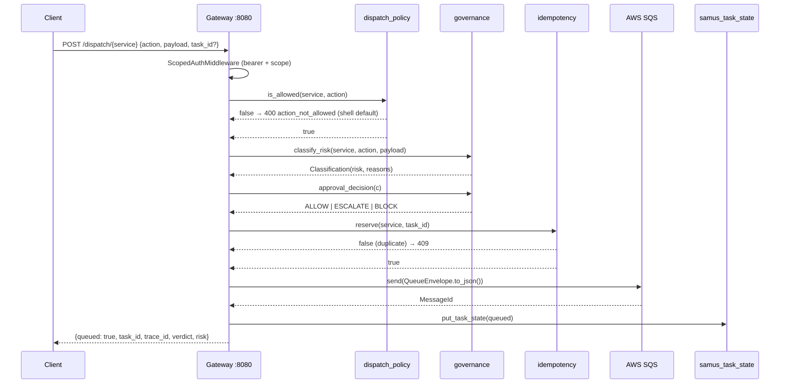

# Samus — Architecture Reference

**Stack:** Python 3.11 · FastAPI · AWS SDK (SQS + DynamoDB + SNS) · Neo4j driver · Anthropic SDK · Prometheus client
**Owner:** Alex Hartman · HustleForge LLC · Marysville, CA
**Runtime:** Docker Compose stack (locally and on HustleForge-VM) + GCP Cloud Run (per-workcell services).
**Status:** 21-workcell Docker Compose stack live; cross-target deployable to GCP Cloud Run from the same image set.

> **Deployment.** Samus runs as a **Docker Compose stack** — local-dev on the Windows operator workstation, optionally mirrored on HustleForge-VM (Ubuntu 24.04 LTS, LAN `192.168.1.240`) for LAN-reachable testing — and as **per-workcell GCP Cloud Run services** (project `${GCP_PROJECT}`, region `us-west1`, AR repo `samus`, services named `samus-<workcell>-2026`) for public ingress. Customer-facing webhooks (Stripe, Vapi, AWS SES) terminate at the gateway service which verifies signatures inline; on Compose, Caddy fronts those routes as a TLS reverse proxy. AWS persistence (SQS / DynamoDB / SNS) lives cross-cloud in `us-west-1` and is shared by every deployment target — failover is automatic (competing-consumers SQS), no cutover required. **LLM inference**: primary = host LM Studio at `<host>:1234`; fallback = Anthropic API direct HTTPS. See [`../Architecture_Ecosystem.md`](../Architecture_Ecosystem.md) §0 for the host/VM split and §4 for the cross-target port map.

> **Update — 2026-06-04 (boot membership).** No Samus-internal change this date. Samus remains the **opt-in Docker exception** — it is **not** in the ecosystem default boot set (`Anita/Darwin/Major/Optimus/Sapphire`). Bring it up explicitly via `Boot-Ecosystem.ps1 -Agents ... Samus`, which routes to `Start-SamusStack.ps1`; it is not an `svc_<Agent>` scheduled task and is not health-polled by the boot engine. See `Architecture_Ecosystem.md` §1.6.

> **Cross-reference.** [`../Architecture_Ecosystem.md`](../Architecture_Ecosystem.md) holds the canonical ecosystem port map (§4), authentication boundaries (§5), service-account mapping (§7), and inter-agent communication graph (§9). This document is Samus-specific; it does not restate ecosystem-level facts.
>
> **Lineage template.** [`../Canon/Architecture_HustleAgent_v1.md`](../Canon/Architecture_HustleAgent_v1.md) is the forward-looking 3-tier (CORE / STANDARD / PACKS) blueprint for spawning Hustleforge-lineage agents (Samus, Anita, Sapphire, Darwin, Major) from the `hustle_agent/` template. It lives in the isolated `Canon/` source-of-truth folder (moved out of this agent dir 2026-05-13). It is the *spawn template*; this document is the *currently-running shell*. Both are canonical and complementary.
>
---

## 1. Scope

This document is the **ecosystem-level cross-reference** for Samus — the
agent-level conventions Samus must satisfy regardless of which workcells
ship: heartbeat shape, audit-ledger contract, governance escalation,
configuration env-var list, cross-agent pointers, and naming conventions.

> **For implementation detail** — module layout, capability registry,
> per-workcell endpoints, LLM budget, DynamoDB tables, SQS topology,
> trust boundaries on public surfaces, and tests — see
> [`ARCHITECTURE.md`](ARCHITECTURE.md). That document is the source of
> truth for what Samus actually runs.

Samus today is a 21-workcell sales engine running as a Docker Compose
stack (gateway + leadgen + prospecting + scaffold + fulfillment + memory
+ feedback + outreach + optimizer + proposal + seo + finance + voice +
intake + crm + strategy + signal_filter + path_optimizer +
template_recovery + portfolio_controller + entropy). The last five form
the v1.3.0 autonomous observe/decide/recover/coordinate layer — HTTP-only,
deterministic, zero-LLM, all registering capability `plan_execution`. The
agent shell described below (heartbeat, audit, governance, dispatch) is the
foundation every workcell rides on. Sections §2–§13 below describe
shell-level concerns; per-workcell behavior lives in `ARCHITECTURE.md` §4.

---

## 2. Runtime

Samus runs as containers in every supported environment. The two deployment
targets are **Docker Compose** (local-dev on the Windows operator workstation,
mirrored on HustleForge-VM at `192.168.1.240` for LAN-reachable testing) and
**GCP Cloud Run** (per-workcell services for public ingress). The same image
set runs on both.

| Aspect | Docker Compose (host dev + HustleForge-VM) | GCP Cloud Run |
|---|---|---|
| Operating system | container-internal — image built `FROM python:3.11-slim`; host OS is Windows 11 (dev) or Ubuntu 24.04 LTS (VM) | container-internal — same image; Cloud Run manages the host |
| Runtime identity | non-root user `samus` (UID 10001) inside each container; host user is the operator on Windows-dev or `hustleforge` on the VM | non-root `samus` inside the container; Cloud Run service account `${GCP_PROJECT_NUMBER}-compute@developer.gserviceaccount.com` |
| Code root | inside the container; built from `D:\Hustleforge\Samus\` (host dev) or the same compose project synced to the VM | inside the container; published from the AR repo `samus` in project `${GCP_PROJECT}` |
| Data root | bind-mounted: `D:\Hustleforge\Samus\.data\` (host dev, anchored per `project_samus_anchor_pipeline`) → `/opt/samus/data` inside the container | Cloud Run is stateless — persistence lives in cross-cloud AWS (SQS / DynamoDB / SNS in `us-west-1`); GCS bucket optional for artifact mirror |
| Python | 3.11 inside each Compose service image | same image |
| Process model | `docker compose up -d` runs the gateway (uvicorn) + 20 domain workcells + 10 SQS worker sidecars + Caddy (TLS) + samus-data-init (one-shot chown). Heartbeat daemon lives inside the gateway container | one Cloud Run service per workcell (`samus-<workcell>-2026`); gateway is the canonical entry point with `min-instances=1`; webhook surfaces (feedback / finance / voice) have `ingress=all` and verify signatures inline |
| Entry | `Start-SamusStack.ps1` (Windows-dev) or `docker compose up -d` (VM) | `gcloud run deploy …` / `Deploy-SamusLocal.ps1` |
| Observability | Prometheus + Grafana as Compose services; scrape `gateway:8080` on the internal network | Cloud Logging + Cloud Run built-in request metrics; optional Prometheus push from inside the container |
| LLM inference | primary = host LM Studio at `<host>:1234`; fallback = Anthropic API direct HTTPS | Anthropic API direct HTTPS (no LM Studio across the public internet) |

---

## 3. Module Map

```
backend/
├── __init__.py
├── security_context.py             boot-time audit shim (binds on import)
├── common/                         shell infrastructure
│   ├── settings.py                 env loader, placeholder rejection, typed Settings dataclass
│   ├── aws.py                      cached boto3 client/resource factories (sqs, sns, ses, ddb)
│   ├── audit.py                    structured JSON audit logger
│   ├── audit_ledger.py             append-only HMAC-SHA256 forward-chained JSONL
│   ├── auth.py                     4-tier bearer-token registry (gateway/admin/replay/readonly)
│   ├── metrics.py                  Prometheus CollectorRegistry + shell-only counters
│   ├── middleware.py               CorrelationMiddleware, RateLimitMiddleware, NonceStore
│   ├── correlation.py              contextvar-backed trace-id propagation
│   ├── governance.py               classify_risk + register_risk framework
│   ├── dispatch_policy.py          (service, action) allowlist framework
│   ├── schema_registry.py          (service, action) → Pydantic schema registry
│   ├── cloudevents.py              QueueEnvelope CloudEvents-1.0 builder
│   ├── sqs.py                      send/receive/delete/change_visibility wrappers
│   ├── sqs_worker.py               long-poll loop with backoff + sleep-jump detection
│   ├── dynamodb.py                 task_state + suppression CRUD helpers
│   ├── idempotency.py              reserve / first_claim / complete / abandon
│   ├── dlq.py                      classify(error) + replay_plan(failure_class, count)
│   ├── worker_base.py              BaseSqsWorker (graceful SIGTERM, metrics, schema validation)
│   ├── health.py                   /health, /ready, /metrics router builder
│   ├── http_client.py              httpx wrapper w/ correlation header injection
│   ├── cost_tracker.py             CODB CostEvent + record() primitive
│   ├── heartbeat.py                HeartbeatWriter daemon (Pattern B: HTTP + file)
│   ├── email_backend.py            adapter selector (SES vs SendGrid)
│   ├── email_backends/             ses.py + sendgrid.py
│   ├── hivemind_client.py          Neo4j writer + circuit breaker (generic write/run/session)
│   ├── circuit_breaker.py          CLOSED/OPEN/HALF_OPEN state machine
│   ├── agent_session.py            named long-lived daemon registry
│   ├── reconnect_policy.py         exponential backoff + wall-clock-sleep detection
│   ├── capacity_wake.py            two-signal wake gate
│   ├── flush_gate.py               buffer commits during plan-save windows
│   ├── rate_limit.py               sliding-window limiter primitive
│   ├── state.py                    task lifecycle helpers (start/processing/completed/failed)
│   ├── result_emit.py              optional SNS publish (no-op when unconfigured)
│   └── storage.py                  local artifact filesystem under E:\Hustleforge\Samus\data\artifacts
├── gateway/                        FastAPI app on :8080
│   ├── queue_app.py                app factory + endpoint definitions
│   ├── security.py                 ScopedAuthMiddleware (token → identity → scope)
│   ├── sqs_dispatch.py             enqueue_dispatch (governance + idempotency + send)
│   └── audit.py                    control-plane audit helper
├── memory/                         shell-level memory primitives
│   ├── store.py                    DynamoDB-backed k/v with LRU cache
│   └── graph_writer.py             generic re-exports of hivemind_client (write/run/session)
└── tools/                          operator CLIs
    ├── deploy_gate.py              6-check pre-deploy validator
    ├── production_smoke.py         live boot validator (health/ready/metrics/queues/ddb/sqs)
    ├── show_config.py              effective Settings with secrets redacted
    ├── dlq_replay.py               peek + replay (API helper + CLI)
    ├── dlq_monitor.py              auto-replay daemon (polls every interval_s)
    ├── queue_monitor.py            threshold-based SQS depth alerts
    ├── codb_report.py              N-day cost summary from samus_cost_events
    ├── rotate_secrets.py           rotate 5 auto-rotatable keys in .env.prod
    ├── aws_hardening.py            enable SQS KMS + DynamoDB PITR
    ├── cloudwatch_alarms.py        create per-queue depth alarms
    └── retention_policy.py         enable TTL on idempotency + cost_events tables
scripts/
├── health_monitor.py               Task-Scheduler entrypoint (HTTP-only checks)
└── run_health_monitor.bat
observability/
├── prometheus/prometheus.yml       scrapes localhost:8080 only
├── prometheus/alerts.yml           5 generic alerts (GatewayDown, latency, errors, target down, health)
└── grafana/provisioning/           datasource + samus-main dashboard JSON
tests/
├── conftest.py
├── test_governance.py              framework: default-MEDIUM, register_risk, bulk-batch, override
├── test_schema_registry.py         framework: unknown → permissive, registered → enforced
├── test_cloudevents.py             envelope build + roundtrip
└── test_settings.py                bootstrap, SAMUS_SQS_QUEUES parsing, placeholder rejection
```

Sixty-six Python files. Every module is real code that does what its docstring says, with graceful degradation when external creds or peer agents are absent.

---

## 4. Dispatch Path



Every step records to the audit ledger (`dispatch.queued`, `dispatch.blocked`, `dispatch.send_failed`, ...). The QueueEnvelope is CloudEvents 1.0 (`backend/common/cloudevents.py`); `type = "{service}.{action}"`, `subject = task_id`, `traceparent = trace_id`.

A worker that later picks the message up — *if and when one is registered* — uses `BaseSqsWorker._dispatch` for the receive path: validates the envelope, claims idempotency atomically (`first_claim`), invokes the registered handler, then completes or abandons based on the result and failure class.

---

## 5. Heartbeat (Pattern B)

Per Architecture_Ecosystem.md §9, Samus emits a heartbeat on two parallel paths every 30 seconds:

1. **HTTP (canonical):** `POST {SECURITY_SENTINEL_URL}/heartbeat` with an HMAC-SHA256-signed envelope. The signing key is derived from `SAMUS_AGENT_HMAC_SECRET` and a 24-hour rotating epoch (`floor(time.time() / 86400)`). Failures here are silent — Major may not exist yet during agent-skeleton bring-up.

2. **File (observable):** the same envelope written atomically to the bind-mounted heartbeat path — `D:\Hustleforge\Samus\.data\coordination\samus_heartbeat.json` on Windows-dev or `/home/hustleforge/data/_shared/coordination/Samus/samus_heartbeat.json` on the VM, mapped to `/opt/samus/data/coordination/samus_heartbeat.json` inside the gateway container — via `tmp.replace(path)`. Peer agents read this without consulting Major. (Cloud Run is stateless and does not emit the file path; Cloud Run instances rely exclusively on the HTTP heartbeat.)

The envelope payload is intentionally minimal — `{agent_id, ts, process_pid}`. The shape is identical inside a Compose container and inside Cloud Run.

> **Replay-cache hazard.** If a future module ever extends Major's watchdog to read the observable file *and* the HTTP handler validates the same envelope, `env.verify()` must be called from exactly one owner per envelope. The shell's heartbeat writer does not call `verify()`; only Major's HTTP handler should.

---

## 6. Governance

The framework is in `backend/common/governance.py`. The shell ships **no** domain-specific risk heuristics. Defaults:

| Trigger | Classification |
|---|---|
| `(service, action)` registered via `register_risk(...)` | pinned value |
| `payload["items"]` is a list of length > 50 | `HIGH` → `ESCALATE` |
| anything else | `MEDIUM` → `ALLOW` |
| `Risk.CRITICAL` | always `ESCALATE`, writes `governance.critical_observed` to the ledger |
| Major's verdict (when wired) | overrides via `approval_decision(c, override=Verdict.X)` |

Domain modules pin their own risk classes at module-import time:

```python
from backend.common.governance import register_risk, Risk
register_risk("billing", "issue_refund", Risk.CRITICAL)
register_risk("outreach", "send_email", Risk.HIGH)
```

---

## 7. Audit

Every state-changing action emits a structured event through `backend.common.audit.record(event_type, **fields)`:

- It logs a single JSON line on the `samus.audit` Python logger.
- It appends the event to today's HMAC-SHA256 forward-chained ledger under the data root: `/opt/samus/data/evidence/audit/ledger-YYYYMMDD.jsonl` inside the container, bind-mounted from `D:\Hustleforge\Samus\.data\evidence\audit\` on Windows-dev or `/home/hustleforge/data/samus/evidence/audit/` on the VM. On Cloud Run the ledger is container-local and ephemeral — durable audit relies on the SNS event fanout instead.

Each ledger line is `{event, prev, sig}` where `sig = HMAC(prev || canonical_json(event))`. Verifying a segment is a single linear pass (`audit_ledger.verify_segment`); tampering with row N invalidates row N+1's signature.

The signing key is the same `SAMUS_AGENT_HMAC_SECRET` that signs heartbeats — one key, two purposes, both rotated by `python -m backend.tools.rotate_secrets`.

---

## 8. Endpoints

| Method | Path | Scope | Purpose |
|---|---|---|---|
| GET | `/health` | exempt | trivial liveness (process up) |
| GET | `/ready` | exempt | exercises SQS describe, DynamoDB table_status, optional Neo4j connect |
| GET | `/metrics` | exempt | Prometheus text format from the shared `REGISTRY` |
| POST | `/dispatch/{service}` | `dispatch:{service}` | validate + classify + reserve + enqueue (400 if action not registered) |
| GET | `/task/{task_id}` | `task:read` | `samus_task_state` lookup |
| GET | `/queues` | `queues:read` | depth per configured SQS queue |
| GET | `/dlq/{service}` | `dlq:read` | resolve DLQ url for the service |
| POST | `/dlq/{service}/replay` | `dlq:replay` | replay one message via `backend.tools.dlq_replay.replay_one` |

`/dispatch/{service}` and `/dlq/{service}` are exposed regardless of whether any worker is registered. The `dispatch_policy` and `schema_registry` allowlists are empty by default — every dispatch returns 400 until a domain module calls `register(...)`. This is intentional: the wiring is testable before any business action exists.

---

## 9. Configuration

`.env.example` is the source of truth for the shape. On Compose, `Start-SamusStack.ps1` pulls secrets from the Windows DPAPI store and injects them into the `docker compose` child process; on the VM, `docker compose` reads `.env` (mode `0600`) from the project root. On Cloud Run, values bind from GCP Secret Manager.

| Group | Required? | Notes |
|---|---|---|
| `AWS_REGION`, `AWS_ACCESS_KEY_ID`, `AWS_SECRET_ACCESS_KEY` | yes for SQS / DDB | otherwise queue/DDB calls fail at probe time. Use a per-deployment IAM key; do not share one key across host / VM / Cloud Run. |
| `SAMUS_SQS_QUEUES` | optional | comma-separated `service=url,…` pairs; empty by default |
| `DDB_TASK_STATE_TABLE`, `DDB_IDEMPOTENCY_TABLE`, `DDB_COST_EVENTS_TABLE` | yes | three infra tables only |
| `SAMUS_*_TOKEN` (gateway, admin, replay, readonly) | yes if `SAMUS_AUTH_ENABLED=true` | bearer tokens; per-deployment |
| `ANTHROPIC_API_KEY` | yes | LLM fallback per ecosystem canonical (LM Studio primary + Anthropic fallback); the only LLM path on Cloud Run |
| `LM_STUDIO_BASE_URL` | optional | LLM primary endpoint; Compose canonical `http://host.docker.internal:1234/v1`; unset on Cloud Run |
| `SECURITY_SENTINEL_URL` | optional | Major HTTP base; default `http://localhost:8434` |
| `SAMUS_AGENT_HMAC_SECRET` | yes | signs heartbeat + audit-ledger; per-deployment; must equal Major's `SS_HMAC_KEY_SAMUS` |
| `SAMUS_HEARTBEAT_PATH`, `SAMUS_ECOSYSTEM_ROOT`, `SAMUS_AGENT_ID` | defaults provided | resolve under the container data root `/opt/samus/data`; bind-mounted to `D:\Hustleforge\Samus\.data\` (host dev) or `/home/hustleforge/data/samus/` (VM) |
| `NEO4J_URI`, `NEO4J_USER`, `NEO4J_PASSWORD`, `NEO4J_REQUIRED` | optional | Hivemind reads/writes are graceful no-ops when unset. `NEO4J_URI=bolt://hivemind:7687` on a shared Docker network, OR `bolt://host.docker.internal:7687` when Hivemind runs on the container host |
| SQS tuning + DLQ tuning | defaults provided | |

`Settings.assert_required(*names)` rejects placeholder values (`CHANGEME`, `<set me>`, `TBD`, etc.).

---

## 10. Extension Model

A future domain module — say, an experimental "billing" feature — plugs into the shell without modifying any shell code:

```python
# backend/billing/__init__.py
from pydantic import BaseModel, ConfigDict
from backend.common import dispatch_policy, governance, schema_registry
from backend.common.governance import Risk

class IssueRefundPayload(BaseModel):
    model_config = ConfigDict(extra="forbid")
    customer_id: str
    amount_usd: float

dispatch_policy.register("billing", {"issue_refund"})
schema_registry.register("billing", "issue_refund", IssueRefundPayload)
governance.register_risk("billing", "issue_refund", Risk.CRITICAL)

# backend/billing/worker.py
from backend.common.cloudevents import QueueEnvelope
from backend.common.worker_base import BaseSqsWorker, serve_worker

def issue_refund(self, payload, env: QueueEnvelope):
    # real work happens here
    return {"refunded": True, "customer_id": payload["customer_id"]}

class BillingWorker(BaseSqsWorker):
    service = "billing"
    handlers = {"issue_refund": issue_refund}

if __name__ == "__main__":
    serve_worker(BillingWorker())
```

The shell does not need to know billing exists. The gateway will accept `POST /dispatch/billing {action: "issue_refund", payload: ...}` once `backend/billing/__init__.py` is imported (e.g. via an `__init__.py` import or a startup hook), enforce the governance gate, validate the schema, and route to the appropriate SQS queue.

**Hooking the registration at boot.** A future change to `backend/gateway/queue_app.py` can iterate a `BACKEND_MODULES` env-var list and `importlib.import_module(...)` each entry, so the shell stays domain-agnostic but operators control which modules are active per host.

---

## 11. What's Shipped vs Still in `recovery/`

**Shipped** (live workcells — see [`ARCHITECTURE.md`](ARCHITECTURE.md) §4 for
per-workcell behavior):

| Capability | Workcell |
|---|---|
| Lead scoring + qualification | `leadgen` |
| Google Places discovery + LLM-personalized callsheet | `prospecting` |
| Asset generation (proposal pack / implementation plan / operating brief / campaign brief) | `scaffold` |
| Execution planning (DAG primitive) | `fulfillment` |
| K/V + Neo4j graph (`samus.memory`) | `memory` |
| SES bounce / complaint SNS receiver | `feedback` |
| SES outbound + advance_call / log_outcome FSM | `outreach` |
| Multi-armed bandit / portfolio optimizer | `optimizer` |
| Proposal generation + validation | `proposal` |
| Site audit + page optimize + content drafts + PageSpeed CWV | `seo` |
| Stripe ingest + subscriptions + CODB + runway + payment links + webhook | `finance` |
| Vapi outbound dialer + inbound webhook + morning dial | `voice` |
| `hustleforge.tech/onboarding` lead receiver + Gmail poller + SES mirror | `intake` |
| 7-table customer pipeline (prospects/contacts/conversations/call-state/opportunities/operator_tasks/artifacts) | `crm` |
| Edge service: `/dispatch/{target}`, `/autonomy/plan`, `/dlq/*`, `/admin/llm_budgets` | `gateway` |
| Per-workcell daily LLM token budget + EMA-driven adaptive sizing | `common/llm_budget` + `common/llm_client` |
| Prospect pre-qualification gate (enrichment → 7-axis signal → `should_enqueue` ≥0.62) | `signal_filter` |
| `efficiency_ema`-driven execution-route selection | `path_optimizer` |
| Deterministic zero-LLM scaffold-fallback library | `template_recovery` |
| Portfolio signal tracking + adaptive token-quota / priority rebalancing | `portfolio_controller` |
| Entropy-score engine + countermeasure recommendations | `entropy` |

**Ported from `recovery/` since the previous edit of this section:**

| Recovery artifact | Where it lives now |
|---|---|
| `recovery/strategy_engine.py` | `backend/strategy/engine.py` |
| `recovery/campaign_optimizer.py` | `backend/strategy/optimizer.py` + `backend/optimizer/portfolio.py` |
| `recovery/llm_portfolio_manager.py` | `backend/strategy/portfolio_manager.py` (UCB1 bandit + 1 LLM call per propose_allocation) |
| `recovery/realtime_adaptive_agent.py` | `backend/voice/adaptive.py` |
| `recovery/deal_scoring_agent.py` | `backend/crm/scoring.py` (severity-tiered score) + `backend/prospecting/deal_scoring.py` |
| `recovery/autonomous_closer.py` | `backend/outreach/fsm.py` (7-state FSM) |
| `recovery/crm_feedback_engine.py` | `backend/outreach/metrics.py` |
| `recovery/governance_parliament.py` | `backend/common/governance_parliament.py` |
| `recovery/seed_knowledge_v2.py` (SHA-256 dedupe + 800/100 chunking only) | `backend/memory/knowledge_ingest.py` |
| `recovery/archive_reasoning_pipeline.md` (stages 1+2 + partial 4) | `backend/archive/scanner.py` + `backend/common/architecture_snapshot.py` |
| `recovery/fixed_scope_template_pipeline.py` constants | inlined in `backend/services/fulfill_service.py` + `backend/services/scope_planner.py` |
| `recovery/callsheet_product_registry.py` | `backend/retainer/registry.py` (specialized for retainer cycles) |
| Event-driven portfolio re-plan triggers (Lever 3.2) | `backend/strategy/triggers.py` |

**Still designed not built** (port through the existing seams
`capabilities.SERVICE_CAPABILITIES`, `dispatch_policy.register`,
`schema_registry.register`, `governance.register_risk`):

| Capability | Source artifact | Status |
|---|---|---|
| Full DAG-based fulfillment with cross-worker `ingest_result` loop | `recovery/fulfillment_worker_v2.py` | `backend/fulfillment/dag.py` ships the DAG primitive; the cross-worker `ingest_result` feedback loop is not wired |
| Full 7-module adaptive-agent intelligence stack (prospecting_intelligence → dynamic_script → objection_engine → autonomous_closer → crm_feedback → deal_scoring → realtime_adaptive_agent) | `recovery/realtime_adaptive_agent.py` and peers | core nodes shipped (see ported table above); end-to-end orchestration loop across all 7 is not wired |
| LinkedIn / Facebook social agents — live wiring | `recovery/social_adapter_v2.py` | `backend/outreach/social_adapter.py` ships structure + interface; OAuth handshake, token refresh, moderation prechecks deferred |
| Telegram operator alert channel | not yet specified | — |
| Vector knowledge layer (ChromaDB-backed) | `recovery/seed_knowledge_v2.py` (full pipeline) | dedupe + chunking ported; ChromaDB backing intentionally dropped from `requirements.txt` |

Reintroduction does not require restoring the old scaffolding — the shell
already exposes the seams.

---

## 12. Cross-Agent Pointers

Peer addressing is resolved per deployment target, not hardcoded. From inside the Samus gateway container the gateway calls peers via `host.docker.internal` (when peers run on the container host) OR via a shared Docker network name (when peers share a Compose project); on Cloud Run peers are reached over their `samus-<peer>-2026` service URLs. The agent shell's `backend/common/http_client.py` is agnostic — it signs and posts to whatever base URL the settings resolve to.

- **Major (`:8434`)** — Pattern-B heartbeat target; HIGH/CRITICAL governance verdicts escalate here. See [Architecture_Ecosystem.md §3, §5, §9](../Architecture_Ecosystem.md).
- **Darwin (`:9000`)** — final arbiter for HIGH/CRITICAL proposals via Major. Samus does not call Darwin directly; the escalation goes through Major.
- **Hivemind (`bolt://localhost:7687`)** — generic write/run/session primitives in `backend/common/hivemind_client.py`. Per-agent databases (`samus_db`, `collective_db`) are referenced by Architecture_Ecosystem.md §9; the shell does not assume any schema. From inside the Samus gateway container: use `bolt://host.docker.internal:7687` if Hivemind is a separate Compose project, or `bolt://hivemind:7687` if shared Compose network.
- **Anita (`:8420`)** — out of scope for the shell. Future modules that need to escalate to Anita reuse `backend/common/http_client.py`.
- **LLM inference** — primary = host LM Studio at `<host>:1234`; fallback = Anthropic API direct HTTPS. On Compose, `<host>` resolves via `host.docker.internal` when Compose adds the `extra_hosts` mapping. On Cloud Run there is no LM Studio reachable over the public internet, so Cloud Run instances use the Anthropic API path directly.

---

## 13. Naming Notes

- The codebase identifier "Major" replaced "SecuritySentinel" at the documentation level; environment variable names retain `SECURITY_SENTINEL_URL` for backward compatibility (see Architecture_Ecosystem.md §11).
- The metrics namespace remains `smms_*` for CODB counters (`smms_codb_usd_total`, `smms_codb_ops_total`) because Prometheus metric renames are externally observable and not worth the churn. The agent prefix is `samus_*` for everything new (worker, health, DLQ).

---

## 14. operator_console pack + chat enrichment STANDARD plane

**Landed 2026-05-18.** Samus gains an operator-facing chat console as a
new PACK on top of two new STANDARD planes (`chat`, `persona`). The shape
was lifted from Sapphire v2.4.0's three-layer composition (per-chat
enrichment bag + 9-component prompt-piece taxonomy + rotating spice pool),
but **re-implemented from scratch** — Sapphire is AGPL-3.0 and nothing
was copied verbatim. This port mirrors the Optimus port shipped earlier
the same day (`feat(optimus): operator_console pack + chat enrichment
STANDARD plane`, commit `86ced6f`) and the parallel Anita / Major /
Darwin ports.

The default `samus_console` persona ships with trim `#dc2626` (red) —
distinct from the other lineages because Samus runs live production
revenue (CRM, Stripe, voice dialer, outbound SES) and the red trim is a
visual cue that any console action targeting a workcell route is
hitting real customer state, not a sandbox.

### 14.1 Tier split

| Tier | Module | Purpose |
| --- | --- | --- |
| STANDARD | `backend/standard/chat/` | `ChatEnrichmentBag`, `PromptPieceLibrary` (9 canonical kinds), `ScenarioPreset`, `SpicePool`, `EnrichmentResolver` (token sub + bracket sanitiser), `PromptAssembler`, `SpiceRotator`, `EnrichmentCatalogue` |
| STANDARD | `backend/standard/persona/` | `Persona` Pydantic model + `PersonaManager` — JSON-backed registry of operator-facing presentation overlays; ships the default `samus_console` persona with trim `#dc2626` (red) |
| PACK | `backend/packs/operator_console/` | Jinja2 SPA shell + vanilla ES-module front-end + 13 routes under `/api/console/*` + per-chat SQLite WAL history; ships own `_safe_io.py` |

The PACK is **kwargs-driven**. No `Settings` (Samus has no `Settings.py`
in the Anita / Darwin / Optimus sense — the workcell shell uses
`os.environ` reads gated by the gateway, see §9 Configuration) edits
are required. Every knob (`data_root`, `chat_history_db_path`,
`model_backend`, `default_persona_id`, `default_trim_color`,
`auth_callable`) flows into the `Pod.__init__` and is captured in the
pod's closure.

#### Why the pack ships its own `_safe_io.py`

Samus's existing workcells write their state via per-workcell helpers
(SQS queue writers, DDB item put, Stripe webhook persistence) — there is
no single agent-wide `atomic_write_text` equivalent to import from. To
keep the pack self-contained and avoid coupling it to any one
workcell's I/O surface, the pack ships
`backend/packs/operator_console/_safe_io.py` as its own minimal
write helper (write-temp-then-rename, fsync on close, UTF-8). This is
zero-dependency and identical in shape to the helper Major's port uses
locally.

### 14.2 Data flow

```mermaid
flowchart LR
    P[Persona<br/>samus_console]:::std
    B[ChatEnrichmentBag<br/>per-chat overlay]:::std
    A[PromptAssembler]:::std
    PL[PromptPieceLibrary<br/>9 canonical kinds]:::std
    SR[SpiceRotator]:::std
    SP[SpicePool]:::std
    AP[AssembledPrompt<br/>system + user + spice]:::std
    MB[model_backend<br/>default: local_echo]:::core
    H[(SQLite WAL<br/>history.db)]:::pack
    UI[Operator Console SPA<br/>chat view]:::pack

    UI -->|POST /respond| B
    P --> A
    B --> A
    A --> PL
    A --> SR
    SR --> SP
    PL --> AP
    SR --> AP
    AP --> MB
    MB -->|reply| H
    H -->|GET /chats/{id}| UI

    classDef core fill:#fce7f3,stroke:#9d174d,color:#1f1f1f
    classDef std  fill:#ede9fe,stroke:#5b21b6,color:#1f1f1f
    classDef pack fill:#fecaca,stroke:#b91c1c,color:#1f1f1f
```

PACK nodes are tinted Samus's trim red to visually anchor the diagram
to this agent. CORE (pink) is touched only at `model_backend` —
`local_echo` is the default. The workcell LLM clients (per-workcell
`anthropic_messages` calls gated by `llm_budget`, see §11) are
**not** routed through the console — operators wire a real backend via
`model_backend=...` on `Pod.__init__` only if they want console replies
to use a real LLM, and even then the workcell budgets remain separate.

### 14.3 Chat enrichment variable schema

`ChatEnrichmentBag` (Pydantic v2) — per-chat overlay applied on top of
the bound `Persona` at assembly time:

- `preset_id` — optional `ScenarioPreset` id
- `scope_memory`, `scope_goal`, `scope_knowledge`, `scope_people` — booleans gating which Samus memory tier (the `memory` workcell — K/V + Neo4j graph, see §11) the resolver may pull from
- `inject_datetime`, `inject_evidence_tip` — context injectors (the evidence tip surfaces the last seen SQS dispatch sequence as a soft anchor; Samus has no hash-chained ledger of its own, so the anchor is the workcell-shell dispatch counter)
- `custom_context` — free-text operator override
- `spice_enabled`, `spice_turns` — rotating spice pool (one piece per N turns)
- `trim_color` — hex; **live-applied** via the `--trim` CSS custom property in the SPA (overrides persona default for the active chat only)
- `llm_provider`, `llm_model` — both `None` by default → `local_echo`
- `private_chat` — boolean; private chats are flagged `private=1` in SQLite and excluded from cross-chat searches

`PromptPiece` slots — 9 canonical kinds:

```
character · location · relationship · goals · format · scenario · extras[] · emotions[] · spice
```

`extras[]` and `emotions[]` are lists; `spice` is rotated per turn by
`SpiceRotator`; the remaining seven are single-valued. The resolver
substitutes `{tokens}` and sanitises stray `[brackets]`.

### 14.4 Routes (under existing Samus gateway, optional bearer)

| Method | Path | Auth |
| --- | --- | --- |
| GET | `/console` | Optional bearer (`SAMUS_OPERATOR_TOKEN` env, OFF by default) |
| GET | `/console/static/**` | Public (CSS / JS / fonts) |
| GET | `/api/console/state` | Optional bearer |
| GET / POST | `/api/console/personas[/{id}]` | Optional bearer |
| GET | `/api/console/presets[/{id}]` | Optional bearer |
| GET | `/api/console/pieces` | Optional bearer |
| GET / POST / PATCH / DELETE | `/api/console/chats[/{id}]` | Optional bearer |
| POST | `/api/console/chats/{id}/messages` | Optional bearer |
| POST | `/api/console/chats/{id}/assemble` | Optional bearer |
| POST | `/api/console/chats/{id}/respond` | Optional bearer (returns `local_echo` result by default) |

Auth is bound at pack registration via the `auth_callable=...` kwarg.
Samus's existing services rely on the **AWS perimeter** (VPC, SQS IAM,
DDB IAM, SES domain auth) for their authorisation model — there is no
agent-internal bearer pattern equivalent to Anita's
`sn_bearer_required` or Darwin's `SN_API_TOKEN`. The console therefore
makes its auth **optional** via the `SAMUS_OPERATOR_TOKEN` env var:

- env unset (default): the pack's `auth_callable` is a no-op pass-through; the console is reachable to anything that can reach the gateway port (which is itself gated by the deployment's VPC / Caddy rules)
- env set: every `/api/console/*` request must carry `Authorization: Bearer <SAMUS_OPERATOR_TOKEN>`, compared via `hmac.compare_digest`

This matches Samus's existing operational posture (no internal token
proliferation) while letting operators opt-in to per-token auth if the
deployment surface ever needs it.

### 14.5 UI substrate

- Jinja2 shell at `backend/packs/operator_console/templates/index.html`
- Vanilla ES modules under `static/{main.js, core/, features/, views/}`
- Native browser `<script type="importmap">` — no React, no Vue, no bundler, no transpile step
- Six views: `chat`, `workcells`, `crm`, `proposals`, `peers`, `settings` — Samus-specific view set: `workcells` surfaces the per-workcell health + DLQ depth (parallels the existing `/admin/llm_budgets` surface), `crm` surfaces the 7-table customer pipeline (prospects / contacts / conversations / call-state / opportunities / operator_tasks / artifacts — see §11 `crm` workcell), `proposals` surfaces the proposal workcell's generation + validation queue
- Custom CSS with `--trim` live-themed per persona (`samus_console` default `#dc2626`)
- `X-Trace-Id` synthesised client-side to mirror the gateway-side trace middleware

### 14.6 Storage

- Persona registry: `<data_root>/operator_console/personas.json` (atomic-write JSON via the pack's local `_safe_io.py`)
- Prompt catalogues: `<data_root>/operator_console/prompts/{prompt_pieces, scenario_presets, prompt_spices}.json`
- Per-chat history: SQLite WAL at `<data_root>/operator_console/history.db` (path overridable via the `chat_history_db_path=...` kwarg at pack registration)

`<data_root>` resolves via the `SAMUS_DATA_ROOT` env var, defaulting to
`/opt/samus/data` (the in-container data root). The console state is
**never** written into a SQS queue, DDB table, or S3 bucket — it is local
to whichever container runs the Samus gateway, and survives container
restarts via the same bind mount the gateway already uses for its `data/`
directory. On Cloud Run, where there is no bind mount, console state is
ephemeral per instance.

SQLite schema (WAL mode set on connect):

- `chats(id, persona_id, title, trim_color, created_at, updated_at, private)`
- `messages(id, chat_id, role, content, created_at)` with `FK(chat_id) -> chats(id)` and `INDEX(chat_id, created_at)`

The history file is self-contained. Samus has no hash-chained evidence
ledger to route through, so the question of tamper-evidence does not
arise — operator chat history is, and remains, an operator scratchpad.

### 14.7 Vendor neutrality contract

- No `openai` / `anthropic` / `cohere` / `google-generativeai` SDK imports in the pack itself — `local_echo` is the default backend. Samus's workcells DO use `anthropic_messages` directly (see §11 `common/llm_client`), but the console code path never reaches the workcell LLM clients; future console-side providers must be added as `httpx`-backed `BaseProvider` implementations
- No TTS / STT / wakeword / chromadb / sentence-transformers — the heavy stacks Sapphire ships are deliberately not pulled in
- No upstream Sapphire source paste — only the schema shape was lifted from the audit summary; Sapphire is AGPL-3.0, Samus's repo licensing is unaffected
- Persona registry is presentation-only; Samus's workcell-shell identity (persona `samus`, see §9 Configuration) and existing peer-thumbprint registration are unchanged
- `jinja2>=3.1.4` was added to Samus's `requirements.txt` for the SPA shell render

### 14.8 Directory layout

```
backend/
├── standard/
│   ├── chat/
│   │   ├── __init__.py
│   │   ├── enrichment_bag.py        # ChatEnrichmentBag (Pydantic v2)
│   │   ├── prompt_pieces.py         # PromptPieceLibrary + 9 canonical kinds
│   │   ├── scenario_preset.py       # ScenarioPreset
│   │   ├── spice_pool.py            # SpicePool + SpiceRotator
│   │   ├── resolver.py              # EnrichmentResolver (token sub + bracket sanitiser)
│   │   ├── assembler.py             # PromptAssembler -> AssembledPrompt
│   │   ├── catalogue.py             # EnrichmentCatalogue (registry facade)
│   │   └── backends/
│   │       ├── __init__.py
│   │       ├── base.py              # BaseProvider Protocol
│   │       └── local_echo.py        # Deterministic default backend
│   └── persona/
│       ├── __init__.py
│       ├── models.py                # Persona Pydantic model
│       └── manager.py               # PersonaManager (uses pack-local _safe_io)
└── packs/
    └── operator_console/
        ├── __init__.py
        ├── pack.json                # Pack manifest
        ├── pod.py                   # Kwargs-driven Pod (register(app, ...))
        ├── routes.py                # 13 routes under /api/console/*
        ├── history.py               # SQLite WAL history store
        ├── _safe_io.py              # Pack-local atomic write helper (no Settings dep)
        ├── templates/
        │   └── index.html           # Jinja2 SPA shell
        └── static/
            ├── main.js              # ES-module entry
            ├── styles.css           # --trim CSS custom property
            ├── core/
            │   ├── api.js           # fetch helpers + trace-id synth
            │   ├── state.js         # client-side state store
            │   └── router.js        # hash-router for the six views
            ├── features/
            │   ├── personas.js
            │   ├── presets.js
            │   ├── chats.js
            │   └── enrichment.js
            └── views/
                ├── chat.js
                ├── workcells.js     # Samus-specific: per-workcell health + DLQ depth
                ├── crm.js           # Samus-specific: 7-table customer pipeline
                ├── proposals.js     # Samus-specific: proposal workcell queue
                ├── peers.js
                └── settings.js
```

### 14.9 Test coverage

Seven new test modules — **45 tests passing**:

- `tests/unit/test_chat_enrichment_models.py` — bag validation, defaults, immutable kinds
- `tests/unit/test_chat_enrichment_resolver.py` — token substitution, bracket sanitisation, missing-token degradation
- `tests/unit/test_chat_spice_rotator.py` — rotation cadence, empty-pool no-op, deterministic seed
- `tests/unit/test_chat_prompt_assembly.py` — end-to-end Persona + Bag -> AssembledPrompt
- `tests/unit/test_persona_manager.py` — registry CRUD, atomic write via pack-local `_safe_io`, default `samus_console` materialisation
- `tests/unit/test_operator_console_history.py` — SQLite WAL CRUD, private flag, foreign-key cascade
- `tests/smoke/test_operator_console.py` — pod-up smoke: 13 routes resolve, `/respond` returns `local_echo` content, persona trim flows through; optional-bearer behaviour covered (off-by-default + opt-in path)

### 14.10 Boot wiring (not yet done)

The pack is **not** yet registered in Samus's `backend/gateway/queue_app.py`
boot path. The next step is a one-line addition after the existing
backend-module iteration (see §10 Extension Model) — the pod is
instantiated with `data_root=os.environ.get("SAMUS_DATA_ROOT", "/opt/samus/data")`,
`chat_history_db_path=<data_root>/operator_console/history.db`,
`default_persona_id="samus_console"`, and `auth_callable=<optional
SAMUS_OPERATOR_TOKEN bearer or no-op pass-through>`, then `.register(app)`
is called.

Until that line lands, the pack is dormant — the modules import clean,
the tests run green, but no `/api/console/*` route is bound. This is
intentional: registration is the operator's gate on whether the console
goes live. The natural wiring point is alongside the existing
`BACKEND_MODULES` env-var iteration so operators control per-deployment
whether the console is exposed (e.g. on dev hosts but not on the
production gateway behind Caddy).

### 14.11 Cross-references

- §3 Module Map — `backend/standard/chat/`, `backend/standard/persona/`, and `backend/packs/operator_console/` are NEW entries
- §8 Endpoints — the 13 new `/api/console/*` routes are **additive** to the existing dispatch / admin / DLQ surface; no existing route changes
- §9 Configuration — `SAMUS_DATA_ROOT` (defaulting `/opt/samus/data`) and the optional `SAMUS_OPERATOR_TOKEN` are NEW env knobs
- §11 What's Shipped — the operator console is a STANDARD-plane + PACK addition, NOT a workcell; workcell ownership of customer / revenue state is unchanged
- §13 Naming Notes — the `samus_*` metric namespace is unaffected; the console emits no new Prometheus series
- Optimus port reference: `D:/Hustleforge/.worktrees/optimus/Optimus/Architecture_Optimus.md` §15 — same shape, different default persona / trim / view set / auth model

---

## Document History

- **2026-07-05** — ADR-0019 emergency severity + TTL for IRREVERSIBLE rung approvals. The shared
  `AutonomyContract` (`_shared/autonomy/contract.py`) now classifies gate submissions at
  `Rung.IRREVERSIBLE` (Rung-5) as `severity="emergency"` with a configurable TTL (default 300 s,
  floor 30 s) when calling `approval_queue.create()`. Reversible rungs (Rung 0–4) remain `ROUTINE`
  with no deadline. A new `EV_GATE_DELIVERY_FAILED` telemetry event is emitted when the approval
  channel raises an exception during submission. Samus inherits the updated semantics automatically
  via the shared autonomy library; no Samus-specific code changes required. Configurable via
  `AutonomyContract(gate_emergency_ttl_sec=<float>)` at construction time.
